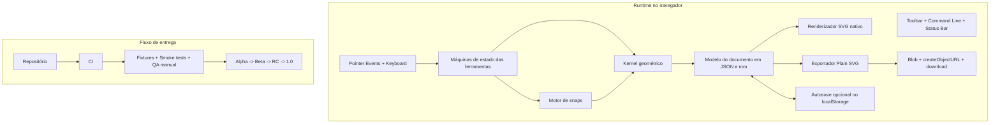

# Plano de projeto para um micro-CAD 2D em navegador

## Sumário executivo

**Download do arquivo Markdown:** [microcad-plano-projeto.md](sandbox:/mnt/data/microcad-plano-projeto.md)

Este plano assume uma equipe pequena de **1–3 desenvolvedores** e um prazo total de **8–12 semanas**, com recomendação-base de **6 sprints de 2 semanas**. O objetivo é entregar um **clone funcional do fluxo central de um CAD 2D clássico**, sem perseguir cópia visual proprietária: desenho técnico em **milímetros**, ferramentas Pareto, snaps, entrada numérica direta, trim/extend, exportação SVG imediata e operação integral no navegador.

A arquitetura recomendada é **KISS e SVG-first**: manter um **modelo geométrico próprio em JavaScript** como fonte da verdade, renderizar a cena em **SVG nativo** no DOM, e exportar um **SVG plain** para download local. SVG 2 é um padrão XML para gráficos vetoriais 2D; a especificação lista formas básicas como `line`, `rect`, `circle`, `polyline` e `path`, e `path` cobre linhas e arcos, o que atende ao núcleo geométrico de um micro-CAD 2D. O atributo `viewBox` define a posição e a dimensão do viewport em user space, o que encaixa naturalmente num sistema de coordenadas em mm. citeturn11view0turn8view5turn8view4turn13search0turn8view2

A stack proposta permanece fiel ao requisito do runtime: **HTML/CSS/JS puro, SVG nativo, Pointer Events, Blob download e localStorage opcional**. A documentação de módulos JavaScript mostra o uso de `type="module"`, estrutura modular por arquivos e a necessidade de testar por servidor local em vez de `file://`, por causa de CORS e do carregamento de módulos. Pointer Events oferecem um único modelo de entrada para mouse, caneta e toque. A plataforma web também já fornece `Blob`, `URL.createObjectURL()` e a propriedade `download` do `<a>` para salvar o SVG localmente. `localStorage` é suficiente para autosave leve e preferências. citeturn16view1turn14view3turn8view6turn8view7turn8view8turn8view11turn8view9turn8view10

A principal restrição operacional vem do LaserGRBL. A FAQ oficial informa que o suporte a SVG ainda está em estágio inicial, que o arquivo é tratado **“as is”**, e que **texto**, **fill** e **semântica distinta por layer/cor** não são suportados. Consequentemente, o exportador deve ser conservador: geometria simples, `fill="none"`, unidades explícitas, e flatten de recursos visuais antes da exportação. citeturn8view0turn12view1

As fontes priorizadas neste plano foram urlMDN Web Docsturn6search0, urlSVG 2 do W3Cturn2search3, urlFAQ oficial do LaserGRBLturn1search3 e, para CI opcional, urlGitHub Actions Docsturn2search8. As decisões técnicas também se apoiam nas práticas documentadas pela entity["organization","W3C","web standards body"], pela entity["organization","Mozilla","web docs publisher"] e, para CI hospedada, pela entity["company","GitHub","developer platform"].

## Base técnica e decisões de arquitetura

A arquitetura deve separar claramente **modelo do documento**, **kernel geométrico**, **máquinas de estado das ferramentas** e **renderização/exportação SVG**. Isso reduz acoplamento, facilita undo/redo, e impede que trim, extend e snapping fiquem presos ao DOM. A recomendação é trabalhar sempre com **mm no modelo** e converter para pixel apenas na camada de viewport/câmera. O método `getScreenCTM()` é adequado para a conversão entre coordenadas de tela e coordenadas do SVG, e `document.createElementNS()` é a base correta para criar nós SVG dinamicamente. `KeyboardEvent.key` e `KeyboardEvent.shiftKey` cobrem a linha de comando, o Enter e o travamento ortogonal com Shift. citeturn8view12turn5view3turn10view0

| Requisito                 | Decisão KISS                                              | Evidência técnica                                                                                                                    |
| ------------------------- | --------------------------------------------------------- | ------------------------------------------------------------------------------------------------------------------------------------ |
| Browser-only              | Aplicação estática sem backend obrigatório                | Módulos JS nativos com `<script type="module">` e execução em servidor local. citeturn16view1turn14view3                         |
| Projeto modular           | Pastas por domínio: `core`, `tools`, `render`, `io`, `ui` | A documentação de módulos mostra estrutura modular e agregação por namespaces. citeturn14view0turn16view2turn16view3            |
| Vetorial nativo           | SVG como renderização e saída                             | SVG 2 define SVG como formato vetorial XML 2D; formas básicas equivalem a paths. citeturn11view0turn8view5turn8view4            |
| Precisão em mm            | Documento, comandos e exportação em mm                    | `viewBox` define user space; o elemento `<svg>` define viewport e sistema de coordenadas. citeturn13search0turn8view2turn8view3 |
| Multi-input               | Pointer Events                                            | Modelo único para mouse/caneta/toque. citeturn8view6                                                                              |
| Download sem backend      | `Blob` + `URL.createObjectURL()` + `<a download>`         | Download local nativo no browser. citeturn8view7turn8view8turn8view11                                                           |
| Autosave simples          | `localStorage` opcional                                   | Persistência simples chave/valor entre sessões. citeturn8view9turn8view10                                                        |
| Compatibilidade LaserGRBL | Exportador “plain SVG”                                    | Importador trata SVG “as is” e não suporta texto/fill/layer semantics. citeturn8view0turn12view1                                 |



| Tecnologia ou abordagem descartada    | Motivo do descarte no MVP                                                                                |
| ------------------------------------- | -------------------------------------------------------------------------------------------------------- |
| Canvas-first                          | Complica exportação SVG limpa e adiciona conversão desnecessária num produto cuja saída nativa já é SVG. |
| React/Vue/Svelte no core              | Aumentam overhead de build e manutenção sem resolver o problema geométrico principal.                    |
| Fabric.js/Konva                       | Úteis em desenho 2D genérico, mas pouco ideais para snaps, trim e extend de precisão CAD.                |
| Paper.js/Two.js como base obrigatória | Criam mais uma camada de abstração entre o modelo e o SVG final.                                         |
| WebGL                                 | Complexidade excessiva para um editor 2D técnico de pequeno e médio porte.                               |
| DXF-first                             | O gargalo real do produto é exportar SVG limpo para LaserGRBL; DXF pode ficar para fase futura.          |
| IndexedDB no MVP                      | Poderoso, mas desnecessário para autosave pequeno; `localStorage` resolve a primeira release.            |

## Escopo, backlog e critérios de aceitação

O MVP deve obedecer estritamente à lógica Pareto: **20% das funcionalidades para cobrir 80% do uso real**. Para o contexto proposto, isso significa priorizar desenho e edição de contornos técnicos simples, furos, arcos, chapas, encaixes e placas. A FAQ do LaserGRBL torna essa priorização ainda mais contundente, porque desincentiva texto vivo, preenchimento e fluxos complexos por layer/cor. citeturn12view1

| Tema                   | MVP Pareto                                                                      | Fase futura                                          |
| ---------------------- | ------------------------------------------------------------------------------- | ---------------------------------------------------- |
| Ferramentas de desenho | `line`, `polyline`, `rect`, `circle`, `arc`                                     | `slot`, `roundedRect`, booleans, mirror, array       |
| Precisão               | endpoint, midpoint, center, intersection, ortho com Shift, entrada de distância | tangent, perpendicular, nearest, tracking temporário |
| Edição                 | select, delete, move simples, trim, extend, undo/redo                           | fillet, chamfer, offset robusto, join/explode        |
| Persistência           | export SVG e autosave opcional                                                  | projeto JSON versionado, importação SVG simples      |
| QA                     | unit tests geométricos, smoke de interação/exportação                           | matriz cross-browser ampliada, roundtrip/import      |
| Operação laser         | plain SVG por preset de exportação                                              | perfis por máquina/material, assistente de kerf      |

| Backlog priorizado  | Objetivo                                          | Entregável                     | Esforço indicativo |
| ------------------- | ------------------------------------------------- | ------------------------------ | -----------------: |
| Shell do editor     | viewport, grid, toolbar, command line, status bar | aplicação navegável            |      8–10 dev-days |
| Modelo do documento | schema em mm, entidades, seleção, histórico base  | fonte da verdade em JSON       |       6–8 dev-days |
| Kernel geométrico   | vetores, tolerâncias, projeções, interseções      | biblioteca matemática testável |     10–14 dev-days |
| Desenho             | line, polyline, rect, circle, arc                 | editor realmente utilizável    |     12–16 dev-days |
| Precisão            | snaps, ortho Shift, entrada numérica              | fluxo CAD operacional          |     10–14 dev-days |
| Edição              | trim, extend, move simples, undo/redo             | núcleo de edição               |     10–14 dev-days |
| Exportação          | SVG plain, download local, presets                | saída compatível com LaserGRBL |      8–10 dev-days |
| QA e docs           | fixtures, smoke tests, docs mínimas               | beta/RC preparados             |      8–10 dev-days |

| Critério de aceitação do MVP | Definição objetiva                                                                                                                                  |
| ---------------------------- | --------------------------------------------------------------------------------------------------------------------------------------------------- |
| Documento em mm              | o usuário abre um documento novo, enxerga grid/cursor e mede tudo em milímetros                                                                     |
| Linha por comando direto     | fluxo “clique → Shift → mover → digitar distância → Enter” gera linha ortogonal com o comprimento pedido                                            |
| Snaps essenciais             | endpoint, midpoint, center e intersection são exibidos e respeitados no commit                                                                      |
| Ferramentas básicas          | é possível desenhar uma chapa com furos, recortes retos e arcos simples                                                                             |
| Edição mínima                | trim e extend funcionam ao menos para `line×line` e `line×circle`                                                                                   |
| Exportação operacional       | o SVG abre no browser e entra no LaserGRBL sem depender de ajuste posterior de size/offset, coerente com o comportamento “as is”. citeturn8view0 |
| Resiliência                  | undo/redo cobre operações principais e autosave não corrompe documento                                                                              |

## Plano de sprints e cronograma

A recomendação mais equilibrada é trabalhar com **6 sprints de 2 semanas**, totalizando 12 semanas. Se houver apenas 1 dev, o plano continua viável desde que o escopo do MVP seja congelado cedo; com 2 devs, o cronograma fica confortável; com 3 devs, o excedente deve ir principalmente para QA, refino geométrico e documentação, e não para inflar funcionalidade.

| Sprint                 | Semanas | Objetivo                                     | Entregáveis                                                                       | Critérios de aceitação                                 | Dependências        | Riscos dominantes                                |        Esforço |
| ---------------------- | ------- | -------------------------------------------- | --------------------------------------------------------------------------------- | ------------------------------------------------------ | ------------------- | ------------------------------------------------ | -------------: |
| Sprint Alpha Zero      | 1–2     | levantar a base do editor                    | shell UI, viewport SVG, câmera, grid, estado global, command line mínima          | app abre, pan/zoom funcionam e o documento está em mm  | nenhuma             | divergência tela↔mundo, espaguete de estado cedo |  9–12 dev-days |
| Sprint Geometry Core   | 3–4     | formar o kernel matemático e o render básico | `Vec2`, tolerâncias, entidades básicas, renderer SVG, ids e seleção inicial       | fixtures geométricas renderizam SVG determinístico     | sprint anterior     | bugs de arco, interseção e tolerância            | 10–12 dev-days |
| Sprint Drawing         | 5–6     | tornar o editor desenhável                   | tools de line/polyline/rect/circle/arc, preview dinâmico, ortho, entrada numérica | usuário desenha placa simples com mouse+teclado        | geometry core       | conflitos de preview/commit/cancelamento         | 10–14 dev-days |
| Sprint Precision       | 7–8     | adicionar precisão tipo CAD                  | snaps essenciais, undo/redo, seleção e move simples                               | snaps visíveis, captura correta, histórico consistente | drawing             | snaps conflitantes, performance                  | 10–14 dev-days |
| Sprint Edit and Export | 9–10    | fechar o núcleo de edição e saída            | trim, extend, export plain SVG, autosave opcional, presets de export              | trim/extend funcionam nos casos-alvo e o SVG é usável  | precision           | serialização incorreta, export inválido          | 10–14 dev-days |
| Sprint Beta Hardening  | 11–12   | endurecer e liberar                          | docs, atalhos, tratamento de erro, regressão, release notes, pacote de exemplos   | checklist de release completo e bugs críticos fechados | todos os anteriores | scope creep e regressões tardias                 |  8–12 dev-days |

| Milestone      | Quando          | Conteúdo esperado                                        |
| -------------- | --------------- | -------------------------------------------------------- |
| Alpha técnica  | fim da sprint 2 | viewport, grid, entidades básicas, render determinístico |
| Alpha usável   | fim da sprint 3 | desenho manual básico com line/rect/circle/arc           |
| Beta funcional | fim da sprint 4 | precisão operacional com snaps e undo/redo               |
| RC             | fim da sprint 5 | trim, extend, exportação estável, smoke compatível       |
| v1.0           | fim da sprint 6 | docs mínimas, pacote de exemplos, release controlada     |

| Release plan    | Frequência             | Porta de saída                         |
| --------------- | ---------------------- | -------------------------------------- |
| Nightly interna | após merge em `main`   | build abre, smoke mínimo verde         |
| Alpha           | fins das sprints 2 e 3 | desenho básico e kernel estáveis       |
| Beta            | fim da sprint 4        | precisão disponível                    |
| RC              | fim da sprint 5        | exportação e compatibilidade aprovadas |
| Stable 1.0      | fim da sprint 6        | checklist completo + aceite do piloto  |

## Estrutura de pastas, convenções e ambiente local

A estrutura abaixo atende ao requisito de projeto modular com `index.html` e arquivos em pastas, preservando o carregamento direto no browser. A documentação de módulos JavaScript mostra `main.js` como módulo de topo e exemplos de organização por diretórios, além de importar módulos por namespace quando isso limpa a arquitetura. citeturn14view0turn16view1turn16view2

```text
microcad/
├─ index.html
├─ assets/
│  ├─ css/
│  │  ├─ reset.css
│  │  ├─ app.css
│  │  └─ theme.css
│  └─ icons/
├─ src/
│  ├─ main.js
│  ├─ app/
│  │  ├─ bootstrap.js
│  │  ├─ state.js
│  │  ├─ shortcuts.js
│  │  └─ config.js
│  ├─ core/
│  │  ├─ geometry/
│  │  │  ├─ vec2.js
│  │  │  ├─ epsilon.js
│  │  │  ├─ line.js
│  │  │  ├─ circle.js
│  │  │  ├─ arc.js
│  │  │  ├─ intersect.js
│  │  │  ├─ project.js
│  │  │  └─ snap.js
│  │  └─ document/
│  │     ├─ schema.js
│  │     ├─ commands.js
│  │     ├─ history.js
│  │     └─ validators.js
│  ├─ render/
│  │  ├─ camera.js
│  │  ├─ svg-root.js
│  │  ├─ entity-renderers.js
│  │  ├─ grid.js
│  │  └─ overlays.js
│  ├─ tools/
│  │  ├─ tool-manager.js
│  │  ├─ select-tool.js
│  │  ├─ line-tool.js
│  │  ├─ polyline-tool.js
│  │  ├─ rect-tool.js
│  │  ├─ circle-tool.js
│  │  ├─ arc-tool.js
│  │  ├─ trim-tool.js
│  │  └─ extend-tool.js
│  ├─ io/
│  │  ├─ export-svg.js
│  │  ├─ file-download.js
│  │  ├─ autosave.js
│  │  └─ import-svg.js
│  ├─ ui/
│  │  ├─ toolbar.js
│  │  ├─ command-line.js
│  │  ├─ statusbar.js
│  │  └─ dialogs.js
│  └─ tests/
│     ├─ fixtures/
│     ├─ unit/
│     ├─ smoke/
│     └─ manual/
├─ docs/
│  ├─ adr/
│  ├─ examples/
│  └─ release/
└─ .github/
   └─ workflows/
      └─ ci.yml
```

| Convenção           | Regra recomendada                                                            |
| ------------------- | ---------------------------------------------------------------------------- |
| Unidades            | **mm** em todo o documento e exportação; pixel só na câmera/render           |
| Ângulos             | UI em graus; kernel pode usar radianos internamente                          |
| Modelo do documento | JSON normalizado, sem estado derivado persistido                             |
| Exportações JS      | preferir **named exports**                                                   |
| Nomes de arquivos   | `kebab-case` por responsabilidade                                            |
| Pureza do core      | `core/geometry` e `core/document` sem DOM                                    |
| Ferramentas         | máquina de estados explícita: `idle`, `armed`, `preview`, `commit`, `cancel` |
| Tipagem             | JSDoc com `@typedef` para entidades, comandos e payloads                     |
| Tolerância          | tudo passa por constantes centralizadas (`EPS`, `SNAP_TOLERANCE`)            |
| Undo/redo           | histórico por comandos, nunca “undo pelo DOM”                                |

Para módulos nativos, o app deve rodar por **servidor local**. A MDN alerta que carregar HTML por `file://` produz erros de CORS em módulos, e também mostra o uso correto de `<script type="module" src="main.js"></script>`. Isso deve entrar como regra de projeto, não como detalhe opcional. citeturn16view1turn14view3

| Ambiente local               | Recomendação                                                                                            |
| ---------------------------- | ------------------------------------------------------------------------------------------------------- |
| Bootstrap HTML               | `<script type="module" src="./src/main.js"></script>`                                                   |
| Servidor mínimo              | `python -m http.server 8080` ou equivalente estático                                                    |
| URL local                    | `http://localhost:8080`                                                                                 |
| Ferramentas opcionais de dev | `package.json` apenas para scripts de teste/lint/smoke, sem dependência no runtime                      |
| Importação futura            | `import-svg.js` preparado para usar `FileReader.readAsText()` quando a fase chegar. citeturn9search1 |

## Testes, QA, riscos e CI

Como o maior risco do produto está no **kernel geométrico** e nas ferramentas de edição, a estratégia de qualidade deve ser mais próxima de software geométrico do que de frontend comum. O custo de descobrir um bug em trim, extend ou snapping apenas no fim do projeto é alto demais; por isso, cada sprint precisa congelar comportamento com testes ou fixtures.

| Camada              | O que testar                                                 | Exemplos mínimos                                                   |
| ------------------- | ------------------------------------------------------------ | ------------------------------------------------------------------ |
| Kernel geométrico   | distância, projeção, interseção, ordenação paramétrica, arco | `line×line`, `line×circle`, `circle×circle`, `isPointOnArc`        |
| Documento/histórico | add/update/delete, undo/redo, serialização                   | criar linha, desfazer, refazer, restaurar snapshot                 |
| Renderização SVG    | entidade → elemento SVG                                      | `line` vira `<line>`, `circle` vira `<circle>`, arco vira `<path>` |
| Interação           | fluxos de ferramenta, snaps e teclado                        | linha com Shift + número + Enter; cancelamento por Esc             |
| Exportação          | XML final, medidas, atributos, plainness                     | documento 128×128 mm, grupo `CUT`, `fill="none"`                   |
| Compatibilidade     | abrir no browser e import smoke                              | amostras de chapa, furos, rasgo, arco                              |
| QA manual           | zoom extremo, pan, mensagens de erro, export múltiplo        | ergonomia e previsibilidade operacional                            |

Para CI hospedada, a escolha mais simples é usar a plataforma da entity["company","GitHub","developer platform"]. A documentação oficial descreve workflows como processos configuráveis em YAML e informa que os arquivos devem ficar em `.github/workflows`. citeturn11view1turn8view13

| Job de CI         | Objetivo                                                                | Gatilho                 |
| ----------------- | ----------------------------------------------------------------------- | ----------------------- |
| `static-check`    | validar sintaxe, estrutura e convenções                                 | `push`, `pull_request`  |
| `unit-geometry`   | rodar testes do kernel e do documento                                   | `push`, `pull_request`  |
| `browser-smoke`   | abrir app em browser headless, executar cenários básicos e exportar SVG | `pull_request`, nightly |
| `artifact-export` | publicar SVGs de fixtures e screenshots de regressão                    | nightly, RC             |
| `release-check`   | garantir checklist e artefatos versionados                              | tags, RC, stable        |

| Risco                                         | Probabilidade | Impacto | Mitigação                                                            |
| --------------------------------------------- | ------------: | ------: | -------------------------------------------------------------------- |
| Núcleo geométrico falhar em casos degenerados |         média |    alto | testes unitários já na sprint 2, tolerâncias centralizadas           |
| Snap ficar lento com muitos elementos         |         média |   médio | limitar busca ao visível no MVP; index espacial só depois            |
| Trim/extend quebrar histórico                 |         média |    alto | modelar tudo como comando reversível                                 |
| Export incompatível com LaserGRBL             |         média |    alto | fixtures “golden”, smoke manual e checklist operacional              |
| Scope creep                                   |          alta |    alto | congelar o MVP cedo e usar a tabela MVP vs fase futura como contrato |
| Divergência tela↔documento                    |         média |    alto | centralizar câmera e conversões world/screen com `getScreenCTM()`    |
| Autosave corromper documento                  |         baixa |    alto | snapshots versionados, debounce e opção de restaurar/limpar          |

## Exportação SVG para LaserGRBL

A saída deve ser tratada como **artefato operacional**, não apenas como visualização. O SVG externo precisa usar `<svg>` com `xmlns` no elemento raiz, `width`/`height` em mm e `viewBox` coerente com a área lógica do documento. Como SVG 2 trata as formas básicas como compatíveis com `path`, o exportador pode manter elementos simples quando possível e cair para `path` quando necessário, especialmente para arcos e futura normalização geométrica. citeturn8view2turn13search0turn8view5turn8view4

```xml
<svg xmlns="http://www.w3.org/2000/svg"
     width="128mm"
     height="128mm"
     viewBox="0 0 128 128">
  <g id="CUT" fill="none" stroke="#ff0000" stroke-width="0.1">
    <line x1="10" y1="10" x2="60" y2="10" />
    <circle cx="64" cy="64" r="8" />
    <path d="M 20 40 A 10 10 0 0 1 40 40" />
  </g>
</svg>
```

Esse formato é coerente com as limitações do LaserGRBL: o importador trata SVG “as is”, não suporta texto, não suporta fill como operação real e não diferencia bem operações por layer/cor. Por isso, a regra é exportar arquivos simples e previsíveis, em vez de SVGs “ricos”. citeturn8view0turn12view1

| Checklist de exportação SVG | Regra                                                                         |
| --------------------------- | ----------------------------------------------------------------------------- |
| Namespace                   | usar `xmlns="http://www.w3.org/2000/svg"` no elemento raiz                    |
| Unidades                    | `width` e `height` em **mm**                                                  |
| Sistema lógico              | `viewBox` alinhado ao documento lógico                                        |
| Geometria                   | preferir `line`, `rect`, `circle`, `polyline` e `path`                        |
| Arcos                       | exportar como `path` com comando `A` ou equivalente                           |
| Fill                        | sempre `fill="none"` para corte/traço                                         |
| Texto                       | não exportar texto vivo; futura função deve converter em path antes do export |
| Camadas/cores               | não depender de semântica por layer/cor; preferir export separado por preset  |
| Efeitos                     | sem `filter`, `mask`, `clipPath`, imagens, gradientes ou CSS complexo         |
| Transformações              | flatten no exportador, para coordenadas finais                                |
| Origem e tamanho            | sair corretos no arquivo final; não contar com ajuste posterior               |
| Pré-validação               | abrir no browser e comparar bounding box antes do download                    |
| Download                    | usar `Blob`, `URL.createObjectURL()` e `<a download>`                         |

A própria FAQ do LaserGRBL sugere converter texto para paths quando necessário e informa que, em caso de preenchimento, apenas o contorno será traçado. Como também não há tratamento distinto seguro por layer/cor, o caminho mais robusto é oferecer presets separados, como `cut.svg`, `mark.svg` e `engrave.svg`, em vez de tentar codificar processo no desenho. citeturn12view1

O download imediato do arquivo pode ser implementado integralmente no navegador com `Blob`, `URL.createObjectURL()` e a propriedade `download` do `<a>`, que permite sugerir o nome do arquivo ao sistema local. citeturn8view7turn8view8turn8view11

## Manutenção, expansão e instruções de download

A manutenção precisa tratar o micro-CAD como um **produto de núcleo geométrico**. O sistema só continua simples de evoluir se as fronteiras forem preservadas: **schema versionado**, **kernel puro**, **ferramentas como máquinas de estado**, **exportador isolado**, **fixtures de regressão** e **ADRs curtos** para decisões estruturais. Quando isso é respeitado, adicionar ferramenta nova passa a ser mais um módulo com testes, e não uma reescrita.

| Estratégia de manutenção   | Política                                                                        |
| -------------------------- | ------------------------------------------------------------------------------- |
| Versionamento do documento | incluir `schemaVersion` no JSON e migradores explícitos                         |
| ADRs                       | registrar decisões em `docs/adr/`                                               |
| Golden fixtures            | manter SVGs e JSONs oficiais como regressão obrigatória                         |
| Feature flags              | funcionalidades novas entram desativadas até estabilização                      |
| Debt budget                | reservar 15–20% da sprint final e releases futuras para refino do kernel/export |
| Compatibilidade            | não quebrar exemplos oficiais sem migração ou nota de release                   |
| Templates de issue         | separar bugs geométricos, bugs de export, bugs de UI e pedidos de feature       |

| Ordem sugerida de expansão pós-MVP | Justificativa                                   |
| ---------------------------------- | ----------------------------------------------- |
| Offset robusto para polylines      | alto valor para folgas, kerf e chapas           |
| Fillet/chamfer                     | muito frequente em desenho técnico simples      |
| `slot` e `roundedRect` nativos     | acelera peças mecânicas e painéis               |
| Importação SVG simples             | facilita roundtrip e biblioteca de exemplos     |
| Cotas visuais não exportáveis      | melhora inspeção sem poluir o SVG final         |
| Layers avançadas                   | úteis, mas não críticas para o objetivo inicial |
| DXF import/export                  | só vale a pena depois de estabilizar o editor   |
| Constraints paramétricas           | representa praticamente outro produto           |

**Instruções de download do arquivo Markdown**

1. Clique em **[microcad-plano-projeto.md](sandbox:/mnt/data/microcad-plano-projeto.md)** para baixar a versão `.md` deste relatório.
2. Se preferir, copie integralmente esta resposta e salve localmente com o nome `microcad-plano-projeto.md`.
3. Mantenha esse arquivo em `docs/` dentro do repositório para que o plano acompanhe ADRs, changelog e releases.

**Questões em aberto e limitações assumidas**

| Tema                     | Assunção usada neste plano                                                                   |
| ------------------------ | -------------------------------------------------------------------------------------------- |
| Área padrão do documento | área configurável, com presets simples; 128×128 mm aparece apenas como referência recorrente |
| Suporte de navegadores   | foco operacional em navegadores desktop modernos, com QA mínima em Chrome/Edge/Firefox       |
| Importação de arquivos   | fora do MVP; entra apenas exportação SVG e autosave opcional                                 |
| Move/copy avançados      | move simples no MVP; cópia paramétrica e arrays ficam para fase futura                       |
| Biblioteca de peças      | exemplos oficiais pequenos no início; biblioteca ampla entra depois                          |
