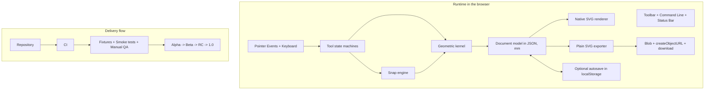

# Project plan for a browser-based 2D micro-CAD

> **Status:** Reference document. Behavior is governed by the code under `src/`; this file is preserved as the frozen plan that motivated v1.0. See [`CLAUDE.md`](../CLAUDE.md) for the live architecture summary and [`adr/`](adr/) for in-force decisions.

## Executive summary

This plan assumed a small team of **1–3 developers** and a total timeline of **8–12 weeks**, with a base recommendation of **6 sprints of 2 weeks**. The goal was to deliver a **working clone of the core flow of a classical 2D CAD**, without chasing a proprietary visual copy: technical drawing in **millimeters**, Pareto tools, snaps, direct numeric input, trim/extend, immediate SVG export, and end-to-end operation in the browser.

The recommended architecture is **KISS and SVG-first**: keep an **in-house geometric model in JavaScript** as the source of truth, render the scene in **native SVG** in the DOM, and export a **plain SVG** for local download. SVG 2 is an XML standard for 2D vector graphics; basic shapes (`line`, `rect`, `circle`, `polyline`, `path`) plus `path` for arcs cover everything the geometric core of a 2D micro-CAD needs. The `viewBox` attribute defines the viewport position and dimensions in user space, which fits naturally with a coordinate system in mm.

The proposed stack stayed faithful to a minimal-runtime requirement: **plain HTML/CSS/JS, native SVG, Pointer Events, Blob download, and optional localStorage**. The migration to TypeScript + Vite + Tauri 2.x kept the SVG-first kernel intact and only swapped the loader/build chain — see [`adr/0001-base-architecture.md`](adr/0001-base-architecture.md) §3 for context.

The main operational constraint comes from LaserGRBL. Its SVG importer treats the file **"as is"** and does not support live text, fill semantics, or distinct semantics per layer/color. As a result, the exporter must be conservative: simple geometry, `fill="none"`, explicit units, and visual-resource flattening before export.

## Technical baseline and architecture decisions

The architecture must clearly separate **document model**, **geometric kernel**, **tool state machines**, and **SVG rendering/export**. This reduces coupling, makes undo/redo easier, and keeps trim, extend, and snapping decoupled from the DOM. The recommendation is to always work with **mm in the model** and convert to pixels only at the viewport/camera layer. `getScreenCTM()` is appropriate for converting between screen coordinates and SVG coordinates, and `document.createElementNS()` is the correct foundation for creating SVG nodes dynamically. `KeyboardEvent.key` and `KeyboardEvent.shiftKey` cover the command line, Enter, and Shift ortho locking.

| Requirement               | KISS decision                                                                                |
| ------------------------- | -------------------------------------------------------------------------------------------- |
| Browser-only              | Static app with no required backend                                                          |
| Modular project           | Folders by domain: `core`, `tools`, `render`, `io`, `ui`                                     |
| Native vectors            | SVG as rendering and output (SVG 2 basic shapes map to paths)                                |
| mm precision              | Document, commands, and export in mm; `viewBox` defines user space                           |
| Multi-input               | Pointer Events for mouse/pen/touch                                                           |
| Download without backend  | `Blob` + `URL.createObjectURL()` + `<a download>` (web); Tauri dialog/fs plugins (native)    |
| Simple autosave           | `localStorage` (web) or `tauri-plugin-store` (native)                                        |
| LaserGRBL compatibility   | "Plain SVG" exporter — importer treats SVG "as is" and rejects text/fill/layer semantics     |



| Technology or approach discarded     | Reason for discarding in the MVP                                                                            |
| ------------------------------------ | ----------------------------------------------------------------------------------------------------------- |
| Canvas-first                         | Complicates clean SVG export and adds unnecessary conversion for a product whose native output is already SVG. |
| React/Vue/Svelte in the core         | Add build/maintenance overhead without solving the main geometric problem.                                  |
| Fabric.js/Konva                      | Useful for generic 2D drawing, but a poor fit for CAD-precision snaps, trim, and extend.                    |
| Paper.js/Two.js as mandatory base    | Add yet another abstraction layer between the model and the final SVG.                                      |
| WebGL                                | Excessive complexity for a small-to-medium technical 2D editor.                                             |
| DXF-first                            | The actual product bottleneck is exporting clean SVG to LaserGRBL; DXF can wait for a future phase.         |
| IndexedDB in the MVP                 | Powerful but unnecessary for small autosave; `localStorage` solves the first release.                       |

## Scope, backlog, and acceptance criteria

The MVP must strictly follow Pareto logic: **20% of the features to cover 80% of real usage**. For the proposed context, that means prioritizing drawing and editing of simple technical outlines, holes, arcs, sheets, joints, and plates. The LaserGRBL FAQ makes this prioritization even sharper, because it discourages live text, fill, and complex per-layer/color flows.

| Theme                  | Pareto MVP                                                                      | Future phase                                          |
| ---------------------- | ------------------------------------------------------------------------------- | ---------------------------------------------------- |
| Drawing tools          | `line`, `polyline`, `rect`, `circle`, `arc`                                     | `slot`, `roundedRect`, booleans, mirror, array       |
| Precision              | endpoint, midpoint, center, intersection, ortho with Shift, distance input      | tangent, perpendicular, nearest, temporary tracking  |
| Editing                | select, delete, simple move, trim, extend, undo/redo                            | fillet, chamfer, robust offset, join/explode         |
| Persistence            | export SVG and optional autosave                                                | versioned JSON project, simple SVG import            |
| QA                     | geometric unit tests, interaction/export smoke                                  | broader cross-browser matrix, roundtrip/import       |
| Laser operation        | plain SVG by export preset                                                      | per-machine/material profiles, kerf assistant        |

| Prioritized backlog | Goal                                              | Deliverable                    | Indicative effort |
| ------------------- | ------------------------------------------------- | ------------------------------ | ----------------: |
| Editor shell        | viewport, grid, toolbar, command line, status bar | navigable application          |     8–10 dev-days |
| Document model      | mm schema, entities, selection, base history      | JSON source of truth           |      6–8 dev-days |
| Geometric kernel    | vectors, tolerances, projections, intersections   | testable math library          |    10–14 dev-days |
| Drawing             | line, polyline, rect, circle, arc                 | a genuinely usable editor      |    12–16 dev-days |
| Precision           | snaps, ortho Shift, numeric input                 | operational CAD flow           |    10–14 dev-days |
| Editing             | trim, extend, simple move, undo/redo             | editing core                   |    10–14 dev-days |
| Export              | plain SVG, local download, presets                | LaserGRBL-compatible output    |     8–10 dev-days |
| QA and docs         | fixtures, smoke tests, minimal docs               | beta/RC prepared               |     8–10 dev-days |

| MVP acceptance criterion     | Objective definition                                                                                                                                |
| ---------------------------- | --------------------------------------------------------------------------------------------------------------------------------------------------- |
| Document in mm               | the user opens a new document, sees grid/cursor, and measures everything in millimeters                                                             |
| Line via direct command      | the "click → Shift → move → type distance → Enter" flow produces an orthogonal line with the requested length                                       |
| Essential snaps              | endpoint, midpoint, center, and intersection are shown and respected on commit                                                                      |
| Basic tools                  | it is possible to draw a sheet with holes, straight cutouts, and simple arcs                                                                        |
| Minimal editing              | trim and extend work at least for `line×line` and `line×circle`                                                                                     |
| Operational export           | the SVG opens in the browser and feeds into LaserGRBL without later size/offset tweaks, consistent with the "as is" behavior                       |
| Resilience                   | undo/redo covers the main operations and autosave does not corrupt the document                                                                     |

## Sprint plan and timeline

The most balanced recommendation is to work with **6 sprints of 2 weeks**, totaling 12 weeks. If there is only 1 dev, the plan remains viable as long as the MVP scope is frozen early; with 2 devs, the timeline is comfortable; with 3 devs, the surplus should go primarily into QA, geometric polish, and documentation, not into inflating functionality.

| Sprint                 | Weeks   | Goal                                          | Deliverables                                                                       | Acceptance criteria                                       | Dependencies         | Dominant risks                                  |          Effort |
| ---------------------- | ------- | --------------------------------------------- | ---------------------------------------------------------------------------------- | --------------------------------------------------------- | -------------------- | ----------------------------------------------- | --------------: |
| Sprint Alpha Zero      | 1–2     | bring up the editor baseline                  | UI shell, SVG viewport, camera, grid, global state, minimal command line           | app opens, pan/zoom work, and the document is in mm       | none                 | screen↔world divergence, state spaghetti early  |   9–12 dev-days |
| Sprint Geometry Core   | 3–4     | shape the math kernel and basic renderer      | `Vec2`, tolerances, basic entities, SVG renderer, ids and initial selection        | geometric fixtures render deterministic SVG               | previous sprint      | arc, intersection, and tolerance bugs           |  10–12 dev-days |
| Sprint Drawing         | 5–6     | make the editor drawable                      | line/polyline/rect/circle/arc tools, live preview, ortho, numeric input            | user draws a simple plate with mouse+keyboard             | geometry core        | preview/commit/cancel conflicts                 |  10–14 dev-days |
| Sprint Precision       | 7–8     | add CAD-style precision                       | essential snaps, undo/redo, simple selection and move                              | visible snaps, correct capture, consistent history        | drawing              | conflicting snaps, performance                  |  10–14 dev-days |
| Sprint Edit and Export | 9–10    | close the editing and output core             | trim, extend, plain SVG export, optional autosave, export presets                  | trim/extend work for target cases and the SVG is usable   | precision            | wrong serialization, invalid export             |  10–14 dev-days |
| Sprint Beta Hardening  | 11–12   | harden and release                            | docs, shortcuts, error handling, regression, release notes, examples pack          | release checklist complete and critical bugs closed       | all previous         | scope creep and late regressions                |   8–12 dev-days |

| Milestone      | When            | Expected content                                            |
| -------------- | --------------- | ----------------------------------------------------------- |
| Technical alpha | end of sprint 2 | viewport, grid, basic entities, deterministic render        |
| Usable alpha   | end of sprint 3 | basic manual drawing with line/rect/circle/arc              |
| Functional beta | end of sprint 4 | operational precision with snaps and undo/redo              |
| RC             | end of sprint 5 | trim, extend, stable export, compatible smoke               |
| v1.0           | end of sprint 6 | minimal docs, examples pack, controlled release             |

| Release plan      | Frequency               | Exit gate                                  |
| ----------------- | ----------------------- | ------------------------------------------ |
| Internal nightly  | after merge to `main`   | build opens, minimal smoke green           |
| Alpha             | ends of sprints 2 and 3 | basic drawing and kernel stable            |
| Beta              | end of sprint 4         | precision available                        |
| RC                | end of sprint 5         | export and compatibility approved          |
| Stable 1.0        | end of sprint 6         | full checklist + pilot sign-off            |

## Folder structure, conventions, and local environment

The structure below satisfies the modular project requirement with `index.html` plus folders, preserving direct loading in the browser. (The repository now uses TypeScript modules + Vite — this layout was the original plan and matches the current `src/` tree by responsibility.)

```text
LaserCAD-R14/
├─ index.html
├─ assets/css/                  reset.css, app.css, theme.css
├─ src/
│  ├─ main.ts
│  ├─ tauri-bridge.ts           runtime split: web vs native
│  ├─ app/                      bootstrap, state, event-bus, shortcuts, config
│  ├─ core/
│  │  ├─ geometry/              vec2, epsilon, line, circle, arc, intersect, project, snap
│  │  └─ document/              schema, validators, commands, history
│  ├─ render/                   camera, svg-root, grid, bed, overlays, entity-renderers
│  ├─ tools/                    tool-manager + line/polyline/rect/circle/arc + select/move/trim/extend
│  ├─ io/                       export-svg, import-svg, file-download, file-actions, autosave
│  └─ ui/                       menubar, toolbar, command-line, statusbar, dialogs, document-size-dialog
├─ src-tauri/                   Rust shell + tauri.conf.json
├─ tests/                       jsdom setup + integration tests
├─ docs/
│  ├─ adr/                      architectural decisions
│  ├─ product/                  product workspace (backlog, demands)
│  ├─ plan.md                   this file
│  ├─ design.md
│  ├─ build-local.md
│  └─ shortcuts.md
└─ .github/workflows/           ci.yml, release.yml
```

| Convention          | Recommended rule                                                              |
| ------------------- | ----------------------------------------------------------------------------- |
| Units               | **mm** throughout the document and export; pixels only in camera/render      |
| Angles              | UI in degrees; the kernel may use radians internally                          |
| Document model      | normalized JSON, with no derived state persisted                              |
| JS exports          | prefer **named exports**                                                      |
| Filenames           | `kebab-case` by responsibility                                                |
| Core purity         | `core/geometry` and `core/document` without DOM                               |
| Tools               | explicit state machine: `idle`, `armed`, `preview`, `commit`, `cancel`        |
| Typing              | JSDoc with `@typedef` for entities, commands, and payloads                    |
| Tolerances          | everything passes through centralized constants (`EPS`, `SNAP_TOLERANCE`)     |
| Undo/redo           | command-based history, never "undo via DOM"                                   |

For native modules, the app must run via a **local server**. Loading HTML from `file://` produces CORS errors for modules. The repository's actual local server is Vite (`npm run dev` → `http://localhost:1420`); the table below records the original plan.

| Local environment             | Recommendation                                                                                            |
| ----------------------------- | --------------------------------------------------------------------------------------------------------- |
| HTML bootstrap                | `<script type="module" src="./src/main.ts"></script>` (resolved by Vite)                                  |
| Minimal server                | `npm run dev` (Vite); `python -m http.server` is enough for `dist/`                                       |
| Local URL                     | `http://localhost:1420`                                                                                   |
| Optional dev tools            | `package.json` with TypeScript, Vite, Vitest, ESLint, Prettier, Tauri CLI                                 |
| File import                   | `src/io/import-svg.ts` covers SVG import for LaserCAD-emitted plain SVG                                   |

## Tests, QA, risks, and CI

Since the product's biggest risk lies in the **geometric kernel** and in the editing tools, the quality strategy should look more like geometric software than typical frontend work. The cost of discovering a trim, extend, or snapping bug only at the end of the project is too high; so each sprint must freeze behavior with tests or fixtures.

| Layer               | What to test                                                  | Minimal examples                                                   |
| ------------------- | ------------------------------------------------------------- | ------------------------------------------------------------------ |
| Geometric kernel    | distance, projection, intersection, parametric ordering, arc  | `line×line`, `line×circle`, `circle×circle`, `isPointOnArc`        |
| Document/history    | add/update/delete, undo/redo, serialization                   | create a line, undo, redo, restore a snapshot                      |
| SVG rendering       | entity → SVG element                                          | `line` becomes `<line>`, `circle` becomes `<circle>`, arc becomes `<path>` |
| Interaction         | tool flows, snaps, and keyboard                               | line with Shift + number + Enter; cancel via Esc                   |
| Export              | final XML, sizes, attributes, plainness                       | 128×128 mm document, `CUT` group, `fill="none"`                    |
| Compatibility       | open in the browser and import smoke                          | samples of plate, holes, slot, arc                                 |
| Manual QA           | extreme zoom, pan, error messages, multiple exports           | ergonomics and operational predictability                          |

For hosted CI, the simplest choice is GitHub Actions. The workflows live in `.github/workflows/` (`ci.yml` and `release.yml`).

| CI job             | Goal                                                                          | Trigger                  |
| ------------------ | ----------------------------------------------------------------------------- | ------------------------ |
| `static-check`     | validate syntax, structure, and conventions                                   | `push`, `pull_request`   |
| `unit-geometry`    | run kernel and document tests                                                 | `push`, `pull_request`   |
| `browser-smoke`    | open the app in a headless browser, run basic scenarios, and export SVG       | `pull_request`, nightly  |
| `artifact-export`  | publish fixture SVGs and regression screenshots                               | nightly, RC              |
| `release-check`    | ensure the checklist and versioned artifacts                                  | tags, RC, stable         |

| Risk                                              | Probability | Impact | Mitigation                                                              |
| ------------------------------------------------- | ----------: | -----: | ---------------------------------------------------------------------- |
| Geometric core fails on degenerate cases          |      medium |   high | unit tests already in sprint 2, centralized tolerances                  |
| Snap becomes slow with many elements              |      medium | medium | limit search to visible elements in the MVP; spatial index only later   |
| Trim/extend breaks history                        |      medium |   high | model everything as reversible commands                                 |
| Export incompatible with LaserGRBL                |      medium |   high | "golden" fixtures, manual smoke, and operational checklist              |
| Scope creep                                       |        high |   high | freeze the MVP early and use the MVP-vs-future table as a contract     |
| Screen↔document divergence                        |      medium |   high | centralize camera and world/screen conversions with `getScreenCTM()`    |
| Autosave corrupts the document                    |         low |   high | versioned snapshots, debounce, and a restore/clear option               |

## SVG export for LaserGRBL

Output must be treated as an **operational artifact**, not just a visualization. The external SVG must use `<svg>` with `xmlns` on the root element, `width`/`height` in mm, and a `viewBox` coherent with the document's logical area. Because SVG 2 treats basic shapes as compatible with `path`, the exporter may keep simple elements when possible and fall back to `path` when necessary, especially for arcs and future geometric normalization.

```xml
<svg xmlns="http://www.w3.org/2000/svg"
     width="128mm"
     height="128mm"
     viewBox="0 0 128 128">
  <g id="CUT" fill="none" stroke="#ff0000" stroke-width="0.1">
    <line x1="10" y1="10" x2="60" y2="10" />
    <circle cx="64" cy="64" r="8" />
    <path d="M 20 40 A 10 10 0 0 1 40 40" />
  </g>
</svg>
```

This format is coherent with LaserGRBL's limitations: the importer treats SVG "as is", does not support text, does not support fill as a real operation, and does not distinguish per-layer/color operations well. Therefore the rule is to export simple, predictable files instead of "rich" SVGs.

| SVG export checklist | Rule                                                                          |
| -------------------- | ----------------------------------------------------------------------------- |
| Namespace            | use `xmlns="http://www.w3.org/2000/svg"` on the root element                  |
| Units                | `width` and `height` in **mm**                                                |
| Logical system       | `viewBox` aligned with the logical document                                   |
| Geometry             | prefer `line`, `rect`, `circle`, `polyline`, and `path`                       |
| Arcs                 | export as `path` with command `A` or equivalent                               |
| Fill                 | always `fill="none"` for cut/stroke                                           |
| Text                 | do not export live text; a future function must convert to path before export |
| Layers/colors        | do not rely on per-layer/color semantics; prefer separate export per preset   |
| Effects              | no `filter`, `mask`, `clipPath`, images, gradients, or complex CSS            |
| Transforms           | flatten in the exporter, into final coordinates                               |
| Origin and size      | correct in the final file; do not rely on later adjustment                    |
| Pre-validation       | open in the browser and compare the bounding box before download              |
| Download             | use `Blob`, `URL.createObjectURL()`, and `<a download>`                       |

The LaserGRBL FAQ itself suggests converting text to paths when needed and says that in the presence of fill, only the outline will be traced. Because there is also no safe per-layer/color distinction, the more robust path is to offer separate presets, such as `cut.svg`, `mark.svg`, and `engrave.svg`, instead of trying to encode the process in the drawing.

Immediate file download can be implemented entirely in the browser with `Blob`, `URL.createObjectURL()`, and the `<a>` `download` property, which lets the system suggest the file name. Under Tauri, the native dialog/fs plugins replace this with an OS save picker.

## Maintenance, expansion, and download instructions

Maintenance must treat the micro-CAD as a **geometric-core product**. The system stays simple to evolve only if the boundaries are preserved: **versioned schema**, **pure kernel**, **tools as state machines**, **isolated exporter**, **regression fixtures**, and **short ADRs** for structural decisions. When that is respected, adding a new tool becomes another module with tests, not a rewrite.

| Maintenance strategy        | Policy                                                                          |
| --------------------------- | ------------------------------------------------------------------------------- |
| Document versioning         | include `schemaVersion` in the JSON and explicit migrators                      |
| ADRs                        | record decisions in `docs/adr/`                                                 |
| Golden fixtures             | keep official SVGs and JSONs as mandatory regression                            |
| Feature flags               | new features land disabled until stabilization                                  |
| Debt budget                 | reserve 15–20% of the last sprint and future releases for kernel/export polish  |
| Compatibility               | do not break official examples without a migration or release note              |
| Issue templates             | separate geometry bugs, export bugs, UI bugs, and feature requests              |

| Suggested post-MVP expansion order  | Justification                                       |
| ----------------------------------- | --------------------------------------------------- |
| Robust offset for polylines         | high value for clearances, kerf, and sheets         |
| Fillet/chamfer                      | very common in simple technical drawing             |
| Native `slot` and `roundedRect`     | speeds up mechanical parts and panels               |
| Simple SVG import                   | enables roundtrip and an example library            |
| Visual non-exportable dimensions    | improves inspection without polluting the final SVG |
| Advanced layers                     | useful but not critical for the initial goal        |
| DXF import/export                   | only worth it after the editor stabilizes           |
| Parametric constraints              | effectively another product                         |

**Open questions and assumed limitations**

| Topic                    | Assumption used in this plan                                                                 |
| ------------------------ | -------------------------------------------------------------------------------------------- |
| Default document area    | configurable area, with simple presets; 128×128 mm appears only as a recurring reference     |
| Browser support          | operational focus on modern desktop browsers, with minimal QA on Chrome/Edge/Firefox         |
| File import              | out of MVP; only SVG export and optional autosave are in scope                               |
| Advanced move/copy       | simple move in the MVP; parametric copy and arrays go to a future phase                      |
| Parts library            | small official examples up front; broader library comes later                                |
